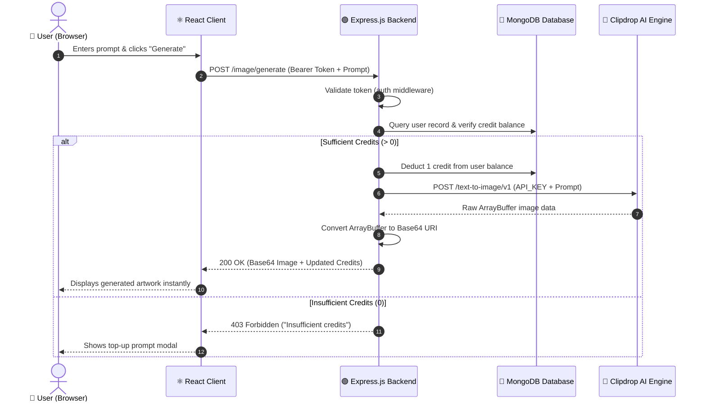

# 🎨 Imagify — Full-Stack AI Image Generator (MERN)

<div align="center">

<p align="center">
  <strong>Transform your imagination into high-resolution AI art in seconds.</strong>
  <br />
  A modern, production-grade full-stack SaaS platform powered by React 19, Tailwind CSS, Express.js, MongoDB, and Clipdrop AI.
</p>

[](https://react.dev/)
[](https://vitejs.dev/)
[](https://tailwindcss.com/)
[](https://nodejs.org/)
[](https://expressjs.com/)
[](https://www.mongodb.com/)
[](LICENSE)

<br />

<!-- PROMINENT LIVE DEMO BUTTON -->
<p align="center">
  <a href="https://imagify-ai-image-generator-mern.vercel.app/" target="_blank" rel="noopener noreferrer">
    
  </a>
</p>

<p align="center">
  <a href="#-features">✨ Explore Features</a> •
  <a href="#-quick-start">⚡ Quick Start</a> •
  <a href="#-architecture">🏗️ Architecture</a> •
  <a href="#-api-reference">🔌 API Docs</a> •
  <a href="#-author">👤 Author</a>
</p>

</div>

---

## 📸 Screenshots & UI Showcase

<div align="center">
  
  <p><em>🏠 Hero Landing Page with dynamic prompt preview and feature highlights</em></p>
</div>

<br />

| 🎨 **AI Generation in Action** | 🔐 **Secure Authentication** |
| :---: | :---: |
|  |  |
| *Real-time prompt processing and image delivery* | *JWT & bcrypt-backed user signup & signin* |
| 💳 **Credit Store & Pricing** | 🖼️ **Responsive UI Experience** |
|  |  |
| *Tiered credit packages & balance management* | *Mobile-first responsive design with Tailwind CSS* |

---

## 📖 Table of Contents

- [🌟 Overview](#-overview)
- [✨ Features](#-features)
- [🛠️ Tech Stack](#️-tech-stack)
- [🏗️ Architecture & Application Flow](#️-architecture--flow)
- [📁 Project Structure](#-project-structure)
- [⚡ Quick Start](#-quick-start)
  - [Prerequisites](#prerequisites)
  - [1. Clone Repository](#1-clone-repository)
  - [2. Frontend Setup](#2-frontend-setup)
  - [3. Backend Setup](#3-backend-setup)
- [⚙️ Environment Variables](#️-environment-variables)
- [🔌 API Reference](#-api-reference)
- [🤖 AI Integration Details](#-ai-integration-details)
- [🔮 Future Roadmap](#-future-roadmap)
- [🤝 Contributing](#-contributing)
- [📜 License](#-license)
- [👤 Author & Connect](#-author--connect)

---

## 🌟 Overview

**Imagify** is a portfolio-ready, full-stack AI SaaS application that enables users to convert creative text descriptions into stunning visual artwork with one click. 

Designed with modern full-stack best practices, Imagify features a decoupled client-server architecture where sensitive API keys and business logic (credit deduction, rate limits, user authentication) are kept secure on the Express server while delivering a blazing-fast user experience with React 19 and Vite.

> [!TIP]
> Try the live deployment right now: **[Imagify Live App](https://imagify-ai-image-generator-mern.vercel.app/)**

---

## ✨ Features

### 🔐 Authentication & Security
- Secure user signup, login, and session persistence via **JSON Web Tokens (JWT)**
- Password hashing with industry-standard **bcryptjs**
- Token-authenticated protected endpoints with custom Express middleware
- Server-side environment isolation ensuring AI API keys remain private

### 🎨 AI Image Generation
- Seamless integration with **Clipdrop Text-to-Image API**
- Automatic conversion from raw binary array buffers to optimized Base64 image payloads
- Immediate rendering and instant download capability for generated artwork

### 💳 Credit & Usage System
- Per-user credit tracking stored in MongoDB
- Automatic deduction per image generation
- Flexible credit top-up / package purchase workflow
- Real-time balance updates in the frontend navigation bar

### 📱 Modern UI & UX
- Built with **React 19** and styled using **Tailwind CSS**
- Smooth animations, interactive buttons, and responsive modal transitions
- Real-time toast notifications powered by `react-toastify`
- Mobile-first, fully responsive layout across all device viewports

---

## 🛠️ Tech Stack

### Frontend
| Technology | Badge | Description |
| :--- | :--- | :--- |
| **React 19** |  | Component-driven UI library |
| **Vite** |  | Next-generation frontend tooling |
| **Tailwind CSS** |  | Utility-first CSS styling framework |
| **React Router DOM** |  | Client-side routing and page navigation |
| **Axios** |  | Promise-based HTTP client |
| **React Toastify** |  | User-friendly toast feedback |

### Backend & Database
| Technology | Badge | Description |
| :--- | :--- | :--- |
| **Node.js** |  | JavaScript runtime environment |
| **Express.js** |  | Web application backend framework |
| **MongoDB** |  | NoSQL document database |
| **Mongoose** |  | Schema-based MongoDB modeling |
| **JWT & Bcrypt** |  | Token generation & password encryption |
| **Clipdrop API** |  | State-of-the-art AI image generation |

---

## 🏗️ Architecture & Flow

### End-to-End Request Lifecycle



---

## 📁 Project Structure

```text
Imagify-AI-Image-Generator-MERN/
├── backend/
│   ├── config/
│   │   └── mongodb.js          # MongoDB connection handler
│   ├── controllers/
│   │   ├── imageController.js  # Clipdrop AI generation & conversion logic
│   │   └── userController.js   # Auth, registration, login, credits
│   ├── middleware/
│   │   └── user.auth.js        # JWT verification middleware
│   ├── models/
│   │   └── userModel.js        # User schema (name, email, password, credits)
│   ├── routes/
│   │   ├── imageRoutes.js      # /image API routes
│   │   └── userRoutes.js       # /user API routes
│   ├── .env.example            # Environment template for backend
│   ├── package.json
│   └── server.js               # Express app entrypoint
│
├── client/
│   ├── public/                 # Static assets & favicon
│   ├── src/
│   │   ├── assets/             # Icons, logos, UI graphics
│   │   ├── components/         # Navbar, Footer, Header, Modals
│   │   ├── context/            # Global AppContext (auth, credits, generator state)
│   │   ├── pages/              # Home, Result, BuyCredit pages
│   │   ├── App.jsx             # Main router component
│   │   ├── index.css           # Tailwind CSS styles
│   │   └── main.jsx            # React root mount
│   ├── .env.example            # Environment template for frontend
│   ├── vite.config.js          # Vite configuration
│   └── package.json
│
├── screenshots/                # Application preview images
├── LICENSE                     # MIT License
└── README.md                   # Project documentation
```

---

## ⚡ Quick Start

### Prerequisites

Ensure you have the following installed on your machine:
- **Node.js** (v18.x or higher) — [Download Node.js](https://nodejs.org/)
- **npm** (v9.x or higher)
- **MongoDB** instance (Local or [MongoDB Atlas URI](https://www.mongodb.com/cloud/atlas))
- **Clipdrop API Key** — [Get Clipdrop Key](https://clipdrop.co/apis)

---

### 1. Clone Repository

```bash
git clone https://github.com/ahm-kamyana/Imagify-AI-Image-Generator-MERN.git
cd Imagify-AI-Image-Generator-MERN
```

---

### 2. Frontend Setup

```bash
# Navigate into the client directory
cd client

# Install dependencies
npm install

# Create local environment configuration
cp .env.example .env

# Start the Vite development server
npm run dev
```

> The client will be running at: **`http://localhost:5173`**

---

### 3. Backend Setup

Open a new terminal window:

```bash
# Navigate into the backend directory
cd backend

# Install dependencies
npm install

# Create local environment configuration
cp .env.example .env

# Start the Express server
npm start
```

> The backend will be running at: **`http://localhost:8080`**

---

## ⚙️ Environment Variables

### Backend Configuration (`backend/.env`)

```env
# Server Port
PORT=8080

# MongoDB Connection URI
MONGODB_URI=mongodb+srv://<username>:<password>@cluster.mongodb.net/imagify

# JWT Authentication Secret
JWT_SECRET=your_super_secret_jwt_key_here

# Clipdrop AI API Key
CLIPDROP_API=your_clipdrop_api_key_here
```

### Frontend Configuration (`client/.env`)

```env
# Backend API Base URL
VITE_BACKEND_URL=http://localhost:8080
```

> [!WARNING]
> Never commit your `.env` files to public repositories. Both `.env` files are ignored by `.gitignore`.

---

## 🔌 API Reference

### User Authentication & Credits (`/api/user`)

| Method | Endpoint | Auth Required | Description |
| :--- | :--- | :---: | :--- |
| `POST` | `/api/user/register` | ❌ No | Create a new user account with initial free credits |
| `POST` | `/api/user/login` | ❌ No | Authenticate user credentials & return JWT token |
| `GET` | `/api/user/credits` | 🔒 Yes | Fetch current user credit balance and profile |
| `POST` | `/api/user/pay-razor` | 🔒 Yes | Initialize credit purchase order |
| `POST` | `/api/user/verify-razor` | 🔒 Yes | Verify transaction & credit account balance |

### Image Generation (`/api/image`)

| Method | Endpoint | Auth Required | Request Body | Description |
| :--- | :--- | :---: | :--- | :--- |
| `POST` | `/api/image/generate-image` | 🔒 Yes | `{ "prompt": "A futuristic city at sunset in cyberpunk style" }` | Deducts 1 credit, queries Clipdrop API, and returns Base64 image |

---

## 🤖 AI Integration Details

The backend handles AI generation securely using Node's `FormData` and `axios`:

```javascript
import axios from "axios";
import FormData from "form-data";

// 1. Build multipart form data with user prompt
const formData = new FormData();
formData.append("prompt", prompt);

// 2. Transmit request with server-held API secret
const { data } = await axios.post(
  "https://clipdrop-api.co/text-to-image/v1",
  formData,
  {
    headers: {
      "x-api-key": process.env.CLIPDROP_API,
      ...formData.getHeaders(),
    },
    responseType: "arraybuffer",
  }
);

// 3. Convert binary image buffer to Base64 string for immediate frontend render
const base64Image = Buffer.from(data, "binary").toString("base64");
const resultImage = `data:image/png;base64,${base64Image}`;
```

---

## 🔮 Future Roadmap

- [ ] **Prompt Enhancement**: Integration with LLM (e.g. Gemini API) to automatically optimize user prompts
- [ ] **Image History & Gallery**: Personal gallery page to browse, re-download, and organize past generated creations
- [ ] **Multiple AI Models**: Support for additional engines (Stable Diffusion XL, Flux, Midjourney API)
- [ ] **Aspect Ratio & Style Presets**: 1:1, 16:9, 9:16 aspect ratios + anime, cinematic, 3D, and photographic styles
- [ ] **Social Sharing**: One-click sharing to Twitter/X, Pinterest, and community showcase

---

## 🤝 Contributing

Contributions make the open-source community an amazing place to learn, inspire, and create! Any contributions you make are **greatly appreciated**.

1. **Fork** the Project
2. **Create** your Feature Branch (`git checkout -b feature/AmazingFeature`)
3. **Commit** your Changes (`git commit -m 'feat: Add some AmazingFeature'`)
4. **Push** to the Branch (`git push origin feature/AmazingFeature`)
5. **Open** a Pull Request

---

## 📜 License

Distributed under the **MIT License**. See [`LICENSE`](LICENSE) for more information.

---

## 👤 Author & Connect

**Muhammad Ahmad**

[](https://www.linkedin.com/in/ahm-kamyana)
[](https://github.com/ahm-kamyana)
[](https://imagify-ai-image-generator-mern.vercel.app/)
[](mailto:ahmad.unbound@gmail.com)

<div align="center">
  <sub>Built with ❤️ by Muhammad Ahmad • If you like this project, please give it a ⭐ on <a href="https://github.com/ahm-kamyana/Imagify-AI-Image-Generator-MERN">GitHub</a>!</sub>
</div>
