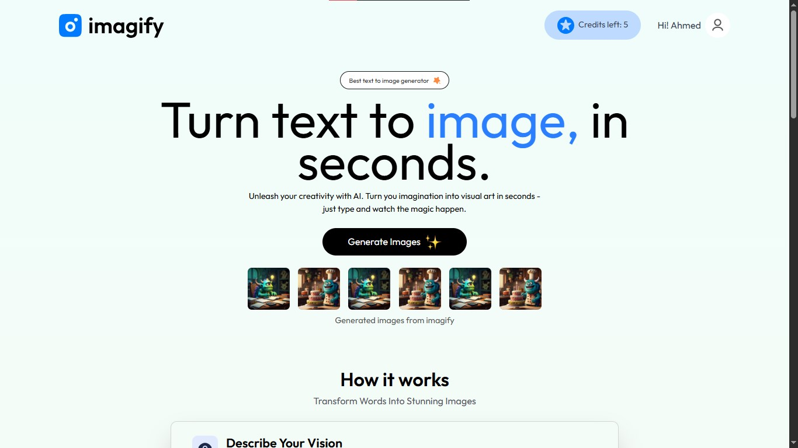
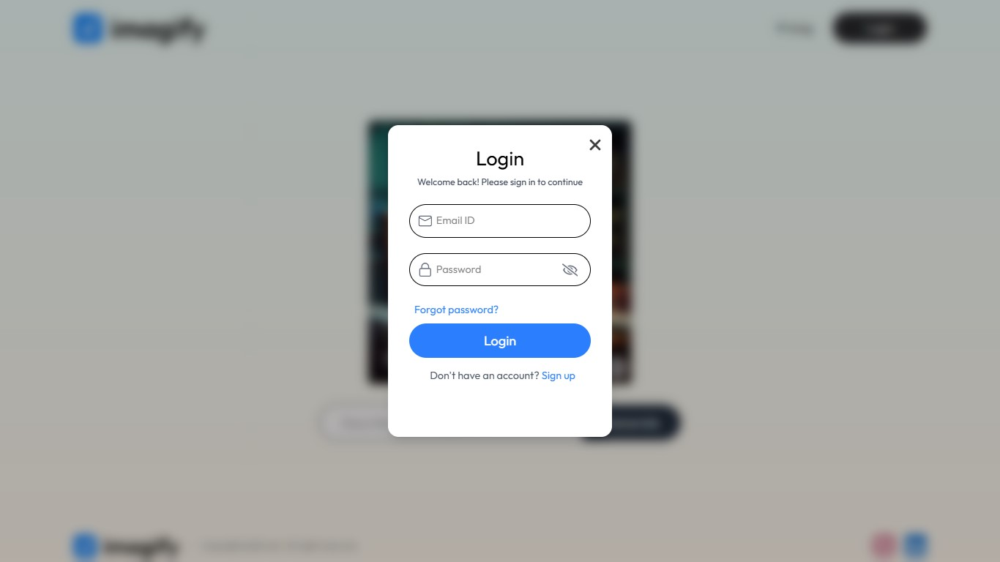
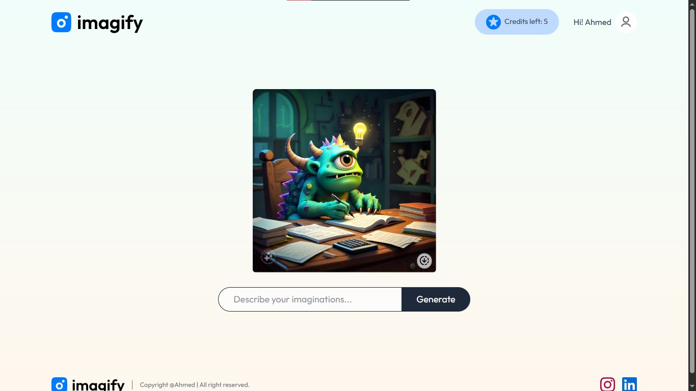
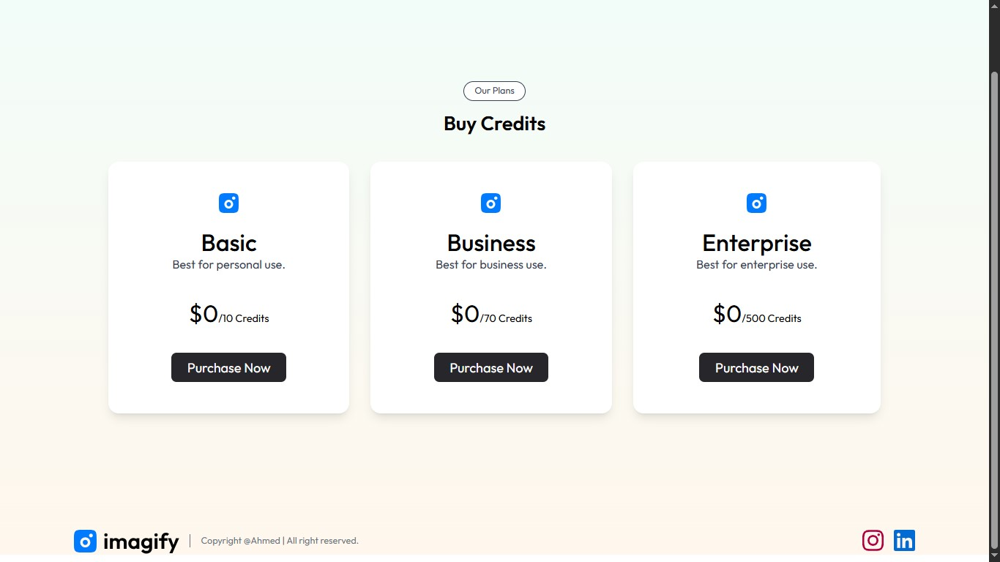

# AI Image Generator Full-Stack Project

<div align="center">


</div>

A portfolio-ready MERN stack project that transforms a text prompt into an AI-generated image. The application includes authentication, credit tracking, a React frontend, an Express backend, and MongoDB-powered data storage.

## Overview

This project is a full-stack AI image generation app built to demonstrate practical MERN development skills. It combines:

- A React + Vite frontend for the user experience
- An Express.js backend for APIs and business logic
- MongoDB + Mongoose for persistent storage
- JWT and bcrypt for authentication
- An external AI image-generation API for generating images from text prompts

The app is structured around a simple client-server flow: users log in, submit a prompt, and the backend validates the request, checks credits, and calls the AI API before returning the generated image.

## Features

- User signup and login
- JWT-based authenticated API access
- Password hashing with bcrypt
- Credit tracking per user
- Prompt-based image generation
- MongoDB-based user management
- Responsive frontend UI with React
- User-friendly notifications with `react-toastify`
- Input validation using `express-validator`

## Tech Stack

| Category       | Technologies                                |
| -------------- | ------------------------------------------- |
| Frontend       | React, Vite, React Router DOM, Tailwind CSS |
| Backend        | Node.js, Express.js                         |
| Database       | MongoDB, Mongoose                           |
| Authentication | JWT, bcrypt                                 |
| Validation     | express-validator                           |
| API Calls      | Axios, FormData                             |
| Styling        | Tailwind CSS                                |
| Notifications  | react-toastify                              |
| AI Integration | Clipdrop text-to-image API                  |

## Application Flow

```text
User enters prompt in frontend
        ↓
React sends request to backend
        ↓
Express validates request and token
        ↓
User credit balance is checked
        ↓
Backend calls AI image-generation API
        ↓
Generated image is converted and returned
        ↓
Frontend displays the result to the user
```

## Architecture

```text
Frontend (React + Vite)
    │
    │  HTTP requests via Axios
    ▼
Backend (Express.js + Node.js)
    │
    │  Auth + validation + credit checks
    │  Calls AI API securely on server
    ▼
MongoDB (User records and credit data)
```

This architecture keeps the AI API key and server logic away from the frontend, which is a common and safer full-stack pattern.

## Project Structure

```text
project-root/
├── backend/
│   ├── config/
│   │   └── mongodb.js
│   ├── controllers/
│   │   ├── imageController.js
│   │   └── userController.js
│   ├── middleware/
│   │   └── user.auth.js
│   ├── models/
│   │   └── userModel.js
│   ├── routes/
│   │   ├── imageRoutes.js
│   │   └── userRoutes.js
│   ├── package.json
│   ├── server.js
│   └── .env.example
├── client/
│   ├── public/
│   ├── src/
│   │   ├── assets/
│   │   ├── components/
│   │   ├── context/
│   │   ├── pages/
│   │   ├── App.jsx
│   │   ├── index.css
│   │   └── main.jsx
│   ├── index.html
│   ├── vite.config.js
│   ├── package.json
│   └── .env.example
├── screenshots/
│   ├── home-page.jpg
│   ├── login-page.jpg
│   ├── result-page.jpg
│   └── credits-buy.jpg
├── .gitignore
├── LICENSE
├── README.md
└── ...
```

## Backend Routes

The backend exposes REST endpoints for user authentication, credit management, and image generation.

| Method | Route               | Description                                             |
| ------ | ------------------- | ------------------------------------------------------- |
| POST   | `/user/register`    | Registers a new user                                    |
| POST   | `/user/login`       | Logs in an existing user                                |
| POST   | `/user/credits`     | Returns the authenticated user's current credit balance |
| POST   | `/user/credits-add` | Adds or updates credit balance                          |
| POST   | `/image/generate`   | Generates an AI image from a text prompt                |

### Route behavior

- `/user/register` validates email and password, hashes the password, and stores the user in MongoDB.
- `/user/login` checks the user record and returns a JWT token for authenticated requests.
- `/user/credits` requires token-based authentication and returns the current credit count.
- `/image/generate` validates the request, checks credits, calls the AI API, converts the response, and returns the generated image.

## Prerequisites

Before running the project locally, ensure you have:

- Node.js installed
- npm installed
- MongoDB running locally or accessible via a valid MongoDB URI
- A valid API key for the AI image-generation service
- Git installed

## Installation

### 1. Clone the repository

```bash
git clone https://github.com/ahm-kamyana/Imagify-AI-Image-Generator-MERN.git
cd Imagify-AI-Image-Generator-MERN
```

### 2. Install frontend dependencies

```bash
cd client
npm install
```

### 3. Install backend dependencies

```bash
cd ../backend
npm install
```

## Environment Setup

The project uses environment variables for configuration. Separate `.env` files are required for the `backend` and `client` directories — an `.env.example` template for each is provided in the repository.

### Configure Environment Variables

1. Copy the example file into place for each app:

```bash
# In the backend directory
cd backend
cp .env.example .env

# In the client directory
cd ../client
cp .env.example .env
```

2. Edit each `.env` file with your actual configuration values:
   - **Backend:** MongoDB URI, JWT secret, AI API key, port
   - **Client:** backend URL (`VITE_BACKEND_URL`)

3. `.env` files are already covered by `.gitignore` — never commit real secrets.

## Frontend Setup

The frontend is powered by React and Vite.

### Run frontend

```bash
cd client
npm run dev
```

The app usually runs on:

```text
http://localhost:5173
```

## Backend Setup

The backend is powered by Express.js and MongoDB.

### Run backend

```bash
cd backend
npm start
```

The backend server usually runs on:

```text
http://localhost:8080
```

## Database Configuration

The application uses MongoDB with Mongoose. The connection is established in the backend configuration file and the app stores user data and credit information in the `imagify` database.

### Database responsibilities

- Stores user names, emails, passwords, and credit balances
- Validates login/registration requests
- Reads and updates credit data for authenticated users

## AI Integration

The backend sends a request to the external AI image engine using `axios` and `FormData`.

```js
const formData = new FormData();
formData.append("prompt", prompt);

const { data } = await axios.post(
  "https://clipdrop-api.co/text-to-image/v1",
  formData,
  {
    headers: {
      "x-api-key": process.env.API_KEY,
      ...formData.getHeaders(),
    },
    responseType: "arraybuffer",
  },
);
```

The returned image data is converted into a base64 string and sent back to the frontend for display.

## Running the Full Project

Open two terminals and run both apps together:

```bash
# Terminal 1
cd client
npm run dev

# Terminal 2
cd backend
npm start
```

## Screenshots

<div align="center">

### Home Page



### Login Page



### Generated Result



### Buy Credits



</div>

## Why This Project Is Valuable

This project demonstrates several important MERN stack skills:

- React frontend development
- REST API communication
- Express.js backend development
- MongoDB data storage and retrieval
- Authentication using JWT and bcrypt
- Environment variable configuration
- Server-side API integration
- Frontend/backend separation
- Asynchronous request handling

## Future Improvements

- Add user profile management
- Add image history for previous generations
- Improve UI flow and loading states
- Add a proper payment/credit purchase flow
- Improve validation and error messages
- Add deployment configuration for production hosting
- Add more AI prompt presets and model options

## Contributing

Contributions are welcome. If you want to improve this project:

1. Fork the repository
2. Create a feature branch
3. Commit your changes
4. Open a pull request

## License

This project is licensed under the MIT License - see the [LICENSE](LICENSE) file for details.

**MIT License Summary:**

- ✅ You can use, modify, and distribute the software
- ✅ You can use it for commercial purposes
- ✅ You must include a copy of the license and copyright notice
- ❌ The software is provided "as is" with no warranty

## Author

Developed by: Muhammad Ahmad

- Email: ahmad.unbound@gmail.com
- GitHub: https://github.com/ahm-kamyana
- Repository: https://github.com/ahm-kamyana/Imagify-AI-Image-Generator-MERN

## Contact

For collaboration, internship opportunities, or technical discussions, feel free to connect:

- GitHub: https://github.com/ahm-kamyana
- Email: ahmad.unbound@gmail.com

---

This project reflects practical MERN stack development with a working frontend, backend API, MongoDB persistence, and AI-generated image functionality in a portfolio-friendly structure.
